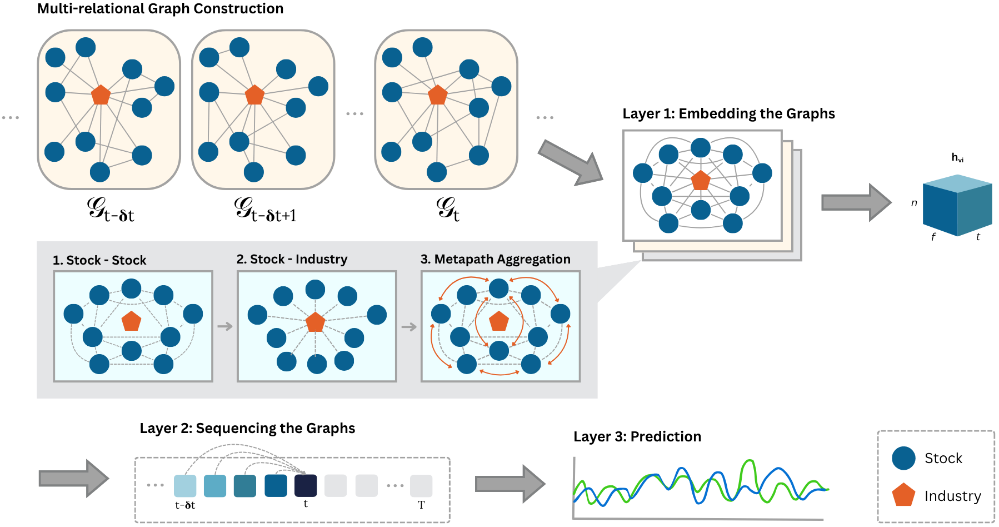

## OmniGNN: Globalized Approach to Multirelational GNNs

[](https://aruzhanabill.github.io/csuremm-gnn/)

[](https://drive.google.com/file/d/1tEP-hnOzikhs5X4bJmCRFy7TeKR0sZsK/view?usp=sharing)


This repository is the official implementation of our [Structure Over Signal: Globalized Approach to Multirelational GNNs][paper].

[paper]: https://drive.google.com/file/d/1tEP-hnOzikhs5X4bJmCRFy7TeKR0sZsK/view?usp=sharing


## 📊Introduction 
In recent years, Graph Neural Networks (GNNs) have been established as the standard for prediction tasks on graph datasets at the graph-, edge-, and node-level, with significant applications in areas such as molecular modeling, transportation networks, and recommendation systems. Particularly, in financial domains, recent fusion models that pair Graph Convolutional Networks (GCNs) with temporal Recurrent Neural Networks (RNNs) like Long Short-Term Memory (LSTM) or Gated Recurrent Units (GRUs) have set the benchmark for dynamic node-level prediction tasks using structures like stock correlation or company knowledge graphs. These models, however, face several limitations. First, although RNNs are well-suited for capturing long-range temporal dependencies, their sequential nature causes memory bottlenecks with the increase in complexity, limiting their capacity to integrate information across the full temporal history. Second, message-passing GCNs that rely solely on one-hop neighborhood aggregation fail to distinguish nonisomorphic graphs with similar local structures. Additionally, the standard GCN aggregation scheme applies uniform averaging to incoming messages, which fails to acknowledge the varying relevance of such messages. Third, many GNNs face the challenge of oversmoothing, generating homogeneous node embeddings after multiple rounds of message-passing, making it difficult for the GNN to learn longer-term dependencies in the graph. While skip connections are commonly utilized to preserve previous node-level information during the update step, this strategy increases the parameter count and model depth, leaving the graph susceptible to oversmoothing 



*Fig. 1: OmniGNN Model Architecture.*

## Dependencies 
The script has been tested running under Python 3.13.0, with the following packages installed (along with their dependencies):
* `numpy==2.3.0`
* `scipy==1.15.3`
* `toch ==2.7.1`

## Usage

```sh
```


## Contributing
This project welcomes contributions and suggestions. 

## License

MIT © 2025 Aruzhan Abil
